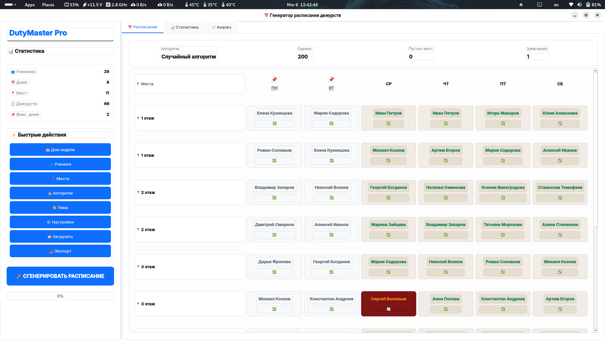
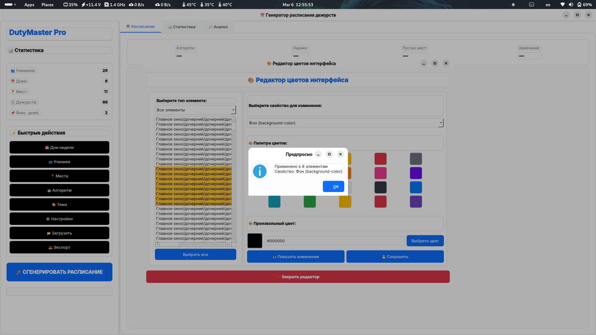
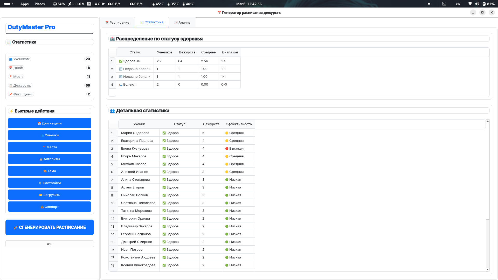

<div align="center">
  
# 📅 DutyMaster Pro v2.0.0


> 🎓 Профессиональный генератор справедливого расписания дежурств  
> 🧠 3 алгоритма • ⚖️ Учёт здоровья • 🎨 Кастомизация • 💾 Автосохранение

</div>

---

## 📋 Оглавление
- [📖 О проекте](#-о-проекте)
- [✨ Возможности](#-возможности)
- [📸 Демонстрация](#-демонстрация)
- [📥 Установка и запуск](#-установка-и-запуск)
- [🎮 Использование](#-использование)
- [🛠 Технологии](#-технологии)
- [🧱 Архитектура](#-архитектура)
- [🔧 Решение проблем](#-решение-проблем)
- [📄 Лицензия](#-лицензия)
- [📬 Контакты](#-контакты)

---

## 📖 О проекте

**DutyMaster Pro** — это мощное десктопное приложение для автоматической генерации справедливого расписания дежурств с учётом статуса здоровья, доступности и приоритетов.

> 🎯 **Основная задача:** Создать оптимальное расписание, где каждый ученик дежурит поровну, а болеющие получают приоритет.

### 🔥 Ключевая особенность
Три алгоритма генерации на выбор:
| Алгоритм | Когда использовать |
|----------|-------------------|
| 🟢 **Жадный** (рекомендуется) | Быстро, оптимально для большинства случаев |
| 🔵 **Назначений** | Точнее, но медленнее — для сложных сценариев |
| 🟡 **Случайный** | Для сравнения и поиска неочевидных решений |

---

## ✨ Возможности

| Фича | Описание |
|------|----------|
| 🧠 **3 алгоритма генерации** | Жадный, задача о назначениях, случайный перебор |
| ⚖️ **Учёт статуса здоровья** | Приоритет здоровым, щадящий режим для недавно болевших |
| 📅 **Гибкое планирование** | 1-7 дней, настраиваемое количество мест и дежурных |
| 📌 **Фиксированные дни** | Закрепление отдельных дней для ручного редактирования |
| 🎨 **Редактор цветов** | Кастомизация любого элемента интерфейса в реальном времени |
| 🌓 **3 темы оформления** | Светлая, тёмная, смешанная (градиент) |
| 📊 **Детальная статистика** | Распределение дежурств, оценка качества, замечания |
| 💾 **Полное автосохранение** | Все настройки, ученики, темы и цвета сохраняются в `settings.json` |
| 📤 **Экспорт расписания** | Выгрузка в текстовый файл с форматированием |

---

## 📸 Демонстрация

<div align="center">

| 🏠 Расписание | 🎨 Редактор цветов | 📊 Статистика |
|:--------------:|:-----------------:|:-------------:|
|  |  |  |
| *Генерация и управление расписанием* | *Кастомизация любого элемента UI* | *Анализ распределения дежурств* |

</div>

---

## 📥 Установка и запуск

### ⚡ Быстрый старт

```bash
# 1. Клонируйте репозиторий
git clone https://github.com/Andrey3141/DutyMaster-Pro.git
cd DutyMaster-Pro

# 2. Установите зависимости
pip install -r requirements.txt

# 3. Запустите приложение
python frontend_main_app.py
```

### 📦 Требования
| Компонент | Версия |
|-----------|--------|
| 🐍 Python | 3.8+ |
| 🪟 PyQt6 | 6.4+ |
| 💻 ОС | Windows / Linux / macOS |

---

## 🎮 Использование

### 1️⃣ Настройка данных

| Действие | Как сделать |
|----------|------------|
| 👥 **Добавить ученика** | «👥 Ученики» → «Добавить» → ФИО + статус здоровья + доступные дни |
| 📍 **Настроить места** | «📍 Места» → Добавить место → Указать количество дежурных |
| 📅 **Выбрать дни** | «📅 Дни недели» → Указать количество дней (1-7) |
| 🤖 **Выбрать алгоритм** | «🤖 Алгоритм» → Жадный / Назначений / Случайный |

### 2️⃣ Генерация расписания

1.  Нажмите **«🚀 СГЕНЕРИРОВАТЬ РАСПИСАНИЕ»**
2.  Дождитесь завершения (прогресс-бар)
3.  Просмотрите результат во вкладках:
    *   📅 **Расписание** — визуальная таблица
    *   📊 **Статистика** — распределение по здоровью и ученикам
    *   📈 **Анализ** — оценка качества и замечания

### 3️⃣ Кастомизация интерфейса

1.  Откройте **«⚙️ Настройки» → «🎨 Редактор цветов»**
2.  Выберите элемент (кнопка, текст, фон, рамка...)
3.  Выберите свойство (цвет фона, текста, шрифт...)
4.  Нажмите **«Показать изменения»** для предпросмотра
5.  Нажмите **«Сохранить»** для применения навсегда

### 🔐 Фиксированные дни

-   При загрузке расписания можно отметить дни как **«фиксированные»** 📌
-   Такие дни выделяются серым и **не редактируются** при генерации
-   Идеально для сохранения ручных правок

---

## 🛠 Технологии

```
🐍 Python 3.8+     — основной язык
🪟 PyQt6 / PySide6 — кроссплатформенный GUI
🧠 Dataclasses     — типизированные структуры данных
🔧 JSON            — хранение настроек и данных
🎨 CSS-like Styles — стилизация виджетов через styleSheet
```

### 📊 Распределение кода

| Модуль | Роль |
|--------|------|
| 🟣 `backend.py` | Ядро: алгоритмы, валидация, оценка качества, визуализация |
| 🟢 `frontend_main_app.py` | Главное окно: интерфейс, логика приложения, интеграция с бэкендом |
| 🔵 `frontend_color_editor.py` | Редактор цветов: рекурсивный обход UI, предпросмотр, сохранение стилей |
| 🟡 `frontend_ui_widgets.py` | Кастомные виджеты: темы, кнопки, карточки, диалоги настроек |

---

## 🧱 Архитектура

```
DutyMaster-Pro/
├── 🐍 backend.py              # Ядро системы
│   ├── 📦 Data Classes
│   │   ├── DayStatus          # Статус ученика на день
│   │   ├── Child              # Информация об ученике
│   │   └── ScheduleResult     # Результат генерации + метрики
│   │
│   ├── 🧭 BaseScheduler       # Базовый класс планировщика
│   │   ├── _validate_input()  # Валидация данных
│   │   ├── calculate_target_distribution() # Целевое распределение
│   │   └── _evaluate_schedule() # Оценка качества
│   │
│   ├── 🤖 Алгоритмы
│   │   ├── GreedyScheduler       # Жадный (рекомендуется)
│   │   ├── AssignmentScheduler   # Задача о назначениях
│   │   └── RandomScheduler       # Случайный перебор
│   │
│   ├── 📊 ScheduleVisualizer  # Визуализация в консоль
│   └── 🏭 DataFactory         # Генерация тестовых данных
│
├── 🎨 frontend_main_app.py    # Главное приложение
│   ├── DutyScheduleApp(QMainWindow)
│   │   ├── setup_ui()              # Инициализация интерфейса
│   │   ├── apply_theme()           # Применение темы + custom_colors
│   │   ├── generate_schedule()     # Запуск генерации
│   │   ├── display_schedule_result() # Отображение результата
│   │   ├── save_settings() / load_settings() # JSON-сериализация
│   │   └── Все диалоги настроек
│
├── 🎨 frontend_color_editor.py  # Редактор цветов
│   ├── ColorEditorDialog        # Основной диалог
│   ├── ElementSelectorWidget    # Выбор элементов интерфейса
│   ├── collect_ui_elements()    # Рекурсивный обход виджетов
│   ├── preview_changes()        # Временный предпросмотр
│   └── apply_property_to_widget() # Применение стилей
│
├── 🧩 frontend_ui_widgets.py    # Кастомные виджеты
│   ├── AppTheme                 # Темы: light / dark / mixed
│   ├── ModernButton / ModernCard # Стильные компоненты
│   ├── SettingsDialog           # Настройка дней + фиксация
│   ├── StudentDialog            # CRUD учеников
│   └── PlacesDialog             # Управление местами
│
├── 📁 settings.json             # Автогенерируемые настройки
│   ├── theme: str
│   ├── custom_colors: dict
│   ├── children_data: list
│   ├── places_config: dict
│   ├── algorithm: str
│   └── fixed_days: list
│
└── 📄 requirements.txt          # Зависимости
```

---

## 🔧 Решение проблем

<details>
<summary>❌ Приложение не запускается: «No module named PySide6»</summary>

```bash
pip install PySide6>=6.4.0
```
</details>

<details>
<summary>❌ Не сохраняются цвета после перезапуска</summary>

1.  Убедитесь, что нажали **«Сохранить»** в редакторе цветов, а не только «Показать изменения»
2.  Проверьте права на запись в папку с приложением
3.  Файл `settings.json` должен создаваться автоматически — не удаляйте его
</details>

<details>
<summary>❌ Расписание генерируется с пустыми местами</summary>

1.  Увеличьте количество доступных учеников
2.  Проверьте, что у учеников отмечены доступные дни
3.  Попробуйте другой алгоритм (например, «Случайный» с большим числом попыток)
</details>

<details>
<summary>❌ Кастомный цвет не применяется к элементу</summary>

1.  Убедитесь, что элемент имеет `objectName` или уникальный тип
2.  Попробуйте выбрать свойство «Фон» или «Текст» — не все CSS-свойства поддерживаются
3.  Проверьте консоль на наличие ошибок применения стиля
</details>

---

## 🤝 Вклад в проект

Приветствуются PR и Issues! 🙌

1.  Форкните репозиторий
2.  Создайте ветку: `git checkout -b feature/your-feature`
3.  Закоммитьте изменения: `git commit -m 'feat: add your feature'`
4.  Отправьте: `git push origin feature/your-feature`
5.  Откройте Pull Request

---

## 📄 Лицензия

<div align="center">

[](LICENSE)

Проект распространяется под лицензией **MIT**.  
См. файл [LICENSE](LICENSE) для подробностей.

</div>

---

<div align="center">

## 📬 Контакты и поддержка

> 💬 Есть вопрос, идея или нашли баг? Пишите!

[](https://github.com/Andrey3141)
[](https://t.me/tools271)
[](mailto:askachkov08@gmail.com)

</div>

---

<div align="center">

### 🙏 Благодарности

- **Qt Company** за отличный фреймворк PyQt6 🪟
- **Сообществу Python** за мощные инструменты разработки 🐍

---

**DutyMaster Pro** — справедливое расписание за секунды. 📅⚖️

*Сделано с ❤️ на Python + PyQt6*

</div>
